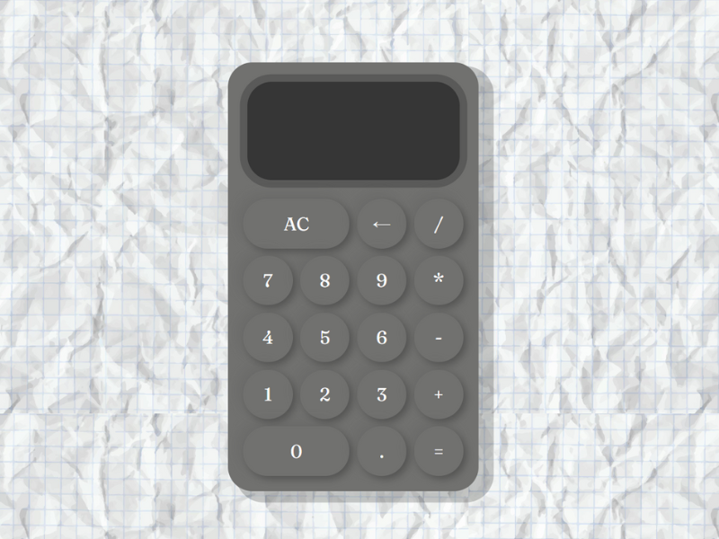

# Calculadora HTML/CSS/JavaScript

Esta es una calculadora web diseñada y desarrollada con HTML, CSS y JavaScript. Proporciona una interfaz intuitiva y funcional para realizar operaciones matemáticas básicas.

## Características

- Suma, resta, multiplicación y división de números.
- Funcionalidad de botón de igual (=) para mostrar el resultado.
- Borrado de la pantalla y reinicio de la calculadora.
- Diseño atractivo y responsivo para adaptarse a diferentes dispositivos.

## Capturas de pantalla

## Cómo utilizar

1. Clona o descarga este repositorio.
2. Abre el archivo `index.html` en tu navegador web.
3. Utiliza los botones numéricos y de operaciones para realizar cálculos.
4. Presiona el botón de igual (=) para obtener el resultado.
5. Para borrar la pantalla y reiniciar la calculadora, presiona el botón "C".

## Personalización

Si deseas personalizar el diseño o añadir más funcionalidades a esta calculadora, puedes modificar el código fuente fácilmente. El archivo principal es `index.html`, donde encontrarás la estructura HTML básica y la referencia a los estilos CSS y scripts JavaScript.

## Contribuciones

Las contribuciones son bienvenidas. Si tienes alguna idea de mejora o encuentras algún error, siéntete libre de abrir un problema o enviar una solicitud de extracción.

## Autor

[Huari Patey Paz] - [https://huaripaz.github.io/]

